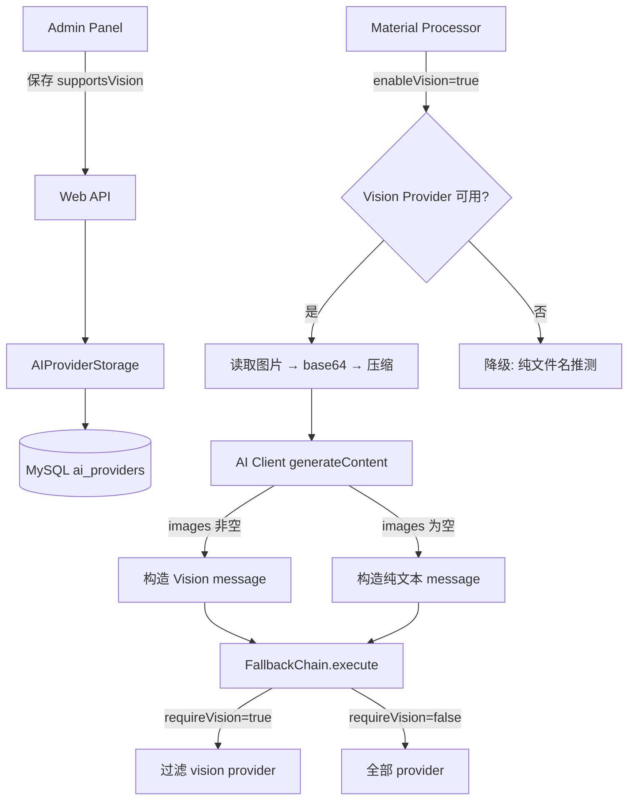

# 技术设计文档：AI Provider Vision Support

## Overview

本设计为现有 AI Provider 基础设施扩展多模态（Vision）能力。核心思路是在数据层标记 provider 是否支持 vision，在调用层构造 OpenAI Vision API 格式的多模态消息，在业务层（素材处理器）按配置决定是否传图，在兜底链路层按 `requireVision` 参数过滤 provider。

**设计原则：最小改动、向后兼容、优雅降级。**

变更范围：
1. `ai_providers` 表新增 `supports_vision` 字段
2. `AIProviderConfig` 类型新增 `supportsVision` 属性
3. `generateContent` 支持 `images` 参数
4. `FallbackChain.execute` 支持 `requireVision` 参数
5. 素材处理器在 enableVision=true 时传图分析
6. 前端表单新增开关控件

## Architecture



## Components and Interfaces

### 1. 存储层变更 (`ai-provider-storage.ts`)

**数据库字段：**

```sql
ALTER TABLE ai_providers ADD COLUMN supports_vision TINYINT(1) DEFAULT 0 COMMENT '是否支持多模态';
```

**接口变更：**

```typescript
// AIProviderRecord 新增字段
export interface AIProviderRecord {
  // ... 现有字段
  supports_vision: boolean;  // 新增
}

// AIProviderConfig 新增可选属性
export interface AIProviderConfig {
  // ... 现有字段
  supportsVision?: boolean;  // 新增
}
```

**方法变更：**
- `createTable`: DDL 中包含 `supports_vision` 字段
- `initialize`: 检测字段不存在时执行 `ALTER TABLE`
- `getEnabledProviders` / `getAllProviders` / `getProviderByName`: SELECT 加入 `supports_vision`，映射为 `supportsVision`
- `saveProvider` / `saveProviders`: INSERT/UPDATE 包含 `supports_vision`

### 2. 配置类型变更 (`config.ts`)

```typescript
export interface AIProviderConfig {
  // ... 现有字段
  supportsVision?: boolean;  // 新增
}
```

### 3. AI Client 变更 (`client.ts`)

**接口变更：**

```typescript
export interface GenerateContentOptions {
  // ... 现有字段
  images?: string[];         // 新增：base64 编码的图片数组，最多 5 张
  requireVision?: boolean;   // 新增：是否需要 vision provider
}
```

**消息构造逻辑：**

```typescript
// 当 images 存在且非空时，构造 Vision API 格式
function buildUserMessage(text: string, images?: string[]): any {
  if (!images || images.length === 0) {
    return { role: 'user', content: text };
  }
  
  // 校验 base64 合法性
  validateBase64Images(images);
  
  const content: any[] = [{ type: 'text', text }];
  for (const img of images) {
    content.push({
      type: 'image_url',
      image_url: { url: `data:image/jpeg;base64,${img}`, detail: 'auto' },
    });
  }
  return { role: 'user', content };
}
```

**校验逻辑：**

```typescript
function validateBase64Images(images: string[]): void {
  if (images.length > 5) {
    throw new Error('images 数组最多包含 5 张图片');
  }
  const base64Regex = /^[A-Za-z0-9+/]*={0,2}$/;
  for (let i = 0; i < images.length; i++) {
    if (!base64Regex.test(images[i])) {
      throw new Error(`images[${i}] 包含非法 base64 字符`);
    }
  }
}
```

### 4. FallbackChain 变更 (`fallback-chain.ts`)

**接口变更：**

```typescript
// execute 方法签名扩展
async execute(
  executeFn: (provider: AIProviderConfig, timeout: number) => Promise<string>,
  scene?: 'comment' | 'post' | 'analysis',
  requireVision?: boolean  // 新增
): Promise<FallbackResult>
```

**过滤逻辑：**

在遍历 provider 之前，根据 `requireVision` 参数过滤：

```typescript
let candidates = providerOrder;
if (requireVision) {
  candidates = providerOrder.filter(name => {
    const instance = this.providers.get(name);
    return instance?.config.supportsVision === true;
  });
  if (candidates.length === 0) {
    return { success: false, usedProvider: '', responseTime: 0, fallbacks: [], errors: [] };
  }
}
```

### 5. 素材处理器变更 (`material-processor.ts`)

**核心变更点：** `generateDescription` 和 `generateTags` 函数

当 `enableVision=true` 且存在可用 vision provider 时：
1. 使用 sharp 将图片压缩至长边 ≤ 2048px、JPEG quality 85
2. 转为 base64 编码
3. 通过 `generateContent({ ..., images: [base64], requireVision: true, timeout: 60000 })` 发起调用

```typescript
async function prepareImageForVision(filePath: string): Promise<string | null> {
  try {
    const image = sharp(filePath);
    const metadata = await image.metadata();
    
    let pipeline = image;
    const maxDim = 2048;
    if ((metadata.width || 0) > maxDim || (metadata.height || 0) > maxDim) {
      pipeline = pipeline.resize(maxDim, maxDim, { fit: 'inside' });
    }
    
    const buffer = await pipeline.jpeg({ quality: 85 }).toBuffer();
    const base64 = buffer.toString('base64');
    
    // 检查大小（20MB ≈ 20 * 1024 * 1024 字符）
    if (base64.length > 20 * 1024 * 1024) {
      logger.warn(`图片压缩后 base64 仍超过 20MB: ${filePath} (${(base64.length / 1024 / 1024).toFixed(1)}MB)`);
      return null;
    }
    
    return base64;
  } catch (error) {
    logger.error(`图片读取/编码失败: ${filePath}, ${error instanceof Error ? error.message : String(error)}`);
    return null;
  }
}
```

**降级策略：**
- vision provider 不可用 → warn 日志 + 纯文件名推测
- 图片压缩后仍超限 → warn 日志 + 纯文件名推测
- 图片读取/编码异常 → error 日志 + 纯文件名推测

### 6. 前端变更 (`index.html`)

在 `addAIProvider` 和 `editAIProvider` 表单中新增开关控件：

```html
<div class="flex items-center gap-2">
  <label class="text-xs text-gray-600">支持多模态</label>
  <input id="new-ai-supportsVision" type="checkbox" class="rounded" />
</div>
```

在 provider 卡片中显示 vision 标识：

```html
<span class="px-2 py-0.5 bg-purple-100 text-purple-700 rounded text-xs">👁 Vision</span>
```

## Data Models

### ai_providers 表结构（变更后）

| 字段 | 类型 | 默认值 | 说明 |
|------|------|--------|------|
| id | INT AUTO_INCREMENT | - | 自增 ID |
| name | VARCHAR(100) | - | 提供商名称 |
| model | VARCHAR(100) | - | 模型名称 |
| base_url | VARCHAR(500) | - | API Base URL |
| api_key | VARCHAR(500) | - | API Key |
| temperature | DECIMAL(3,2) | 0.70 | 温度参数 |
| max_tokens | INT | 4000 | 最大 Token 数 |
| request_timeout | INT | 30000 | 请求超时 (ms) |
| enabled | TINYINT(1) | 1 | 是否启用 |
| priority | INT | 0 | 优先级 |
| **supports_vision** | **TINYINT(1)** | **0** | **是否支持多模态（新增）** |
| created_at | DATETIME | CURRENT_TIMESTAMP | 创建时间 |
| updated_at | DATETIME | CURRENT_TIMESTAMP | 更新时间 |

### AIProviderConfig 接口（变更后）

```typescript
interface AIProviderConfig {
  name: string;
  model: string;
  baseUrl: string;
  apiKey: string;
  temperature?: number;
  maxTokens?: number;
  requestTimeout?: number;
  supportsVision?: boolean;  // 新增
}
```

### GenerateContentOptions 接口（变更后）

```typescript
interface GenerateContentOptions {
  systemPrompt?: string;
  userPrompt?: string;
  temperature?: number;
  maxTokens?: number;
  timeout?: number;
  scene?: 'comment' | 'post' | 'analysis';
  images?: string[];         // 新增：base64 图片数组
  requireVision?: boolean;   // 新增：是否需要 vision provider
}
```

## Correctness Properties

*属性（Property）是在系统所有有效执行中应始终成立的特征或行为 —— 本质上是对系统应做什么的形式化描述。属性是人类可读规范与机器可验证正确性保证之间的桥梁。*

### Property 1: Provider supportsVision 读写 round-trip

*对任意* AIProviderConfig（supportsVision 为 true 或 false），通过 `saveProvider` 写入后，再通过 `getProviderByName` 读取，返回的 `supportsVision` 值应与写入值一致。

**Validates: Requirements 1.2, 1.3**

### Property 2: Vision 消息格式构造正确性

*对任意* 合法 base64 图片数组（长度 1-5），`buildUserMessage` 构造的 message 应满足：content 数组长度 = 1 (text) + images.length (image_url)，每个 image_url 元素的 url 以 `data:image/jpeg;base64,` 开头，detail 为 `auto`。

**Validates: Requirements 2.2**

### Property 3: 非法 base64 输入校验

*对任意* 包含非 base64 合法字符（如中文、特殊符号等）的字符串数组，`validateBase64Images` 应抛出错误，且错误信息包含第一个非法元素的索引值。

**Validates: Requirements 2.4**

### Property 4: 图片压缩尺寸约束

*对任意* 尺寸的图片输入，`prepareImageForVision` 处理后的输出图片长边应 ≤ 2048px，且格式为 JPEG。

**Validates: Requirements 3.4**

### Property 5: FallbackChain vision provider 过滤

*对任意* provider 列表（混合 supportsVision=true/false），当 `requireVision=true` 时，FallbackChain 仅尝试调用 `supportsVision=true` 的 provider，不调用任何 `supportsVision=false` 的 provider。

**Validates: Requirements 4.1**

## Error Handling

| 场景 | 处理方式 |
|------|----------|
| ALTER TABLE 失败 | 记录 error 日志，抛出异常，阻止存储层初始化 |
| images 含非法 base64 | 抛出 Error，指明无效图片索引，不发送请求 |
| images 超过 5 张 | 抛出 Error |
| 图片读取/编码失败 | 降级为纯文件名推测，记录 error 日志 |
| 压缩后 base64 > 20MB | 降级为纯文件名推测，记录 warn 日志 |
| 无可用 vision provider | 降级为纯文件名推测，记录 warn 日志 |
| 所有 vision provider 调用失败 | FallbackChain 返回 success: false，调用方降级 |
| 前端保存 supportsVision 失败 | 显示错误提示，开关恢复保存前状态 |

## Testing Strategy

### 属性测试 (Property-Based Testing)

使用 `fast-check` 库，每个属性测试最少运行 100 次迭代。

| 属性 | 测试文件 | 说明 |
|------|----------|------|
| Property 1 | `tests/pbt/ai-provider-vision-roundtrip.test.ts` | Mock MySQL，验证读写 round-trip |
| Property 2 | `tests/pbt/vision-message-format.test.ts` | 验证 Vision message 构造格式 |
| Property 3 | `tests/pbt/base64-validation.test.ts` | 验证非法 base64 校验逻辑 |
| Property 4 | `tests/pbt/image-compression.test.ts` | 生成随机尺寸图片，验证压缩约束 |
| Property 5 | `tests/pbt/fallback-chain-vision-filter.test.ts` | 验证 vision provider 过滤逻辑 |

标签格式：`// Feature: ai-provider-vision-support, Property {N}: {description}`

### 单元测试

| 模块 | 测试重点 |
|------|----------|
| AIProviderStorage | initialize 迁移逻辑、字段默认值 |
| AI Client | images 为空时纯文本格式、MIME 类型默认值 |
| Material Processor | enableVision=false 不读图、降级场景 |
| FallbackChain | requireVision 默认值行为、无 vision provider 立即返回 |

### 集成测试

| 场景 | 验证内容 |
|------|----------|
| 完整 vision 流程 | enableVision=true + vision provider 可用 → 传图调用 AI |
| 降级流程 | vision provider 全部失败 → 自动降级纯文件名方式 |
| 前端 E2E | 开关修改 → 保存 → 重新加载验证状态 |
