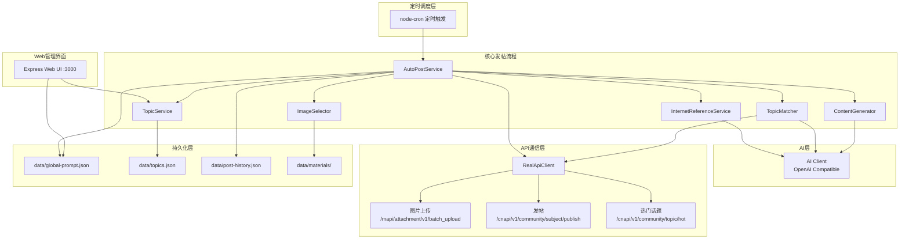
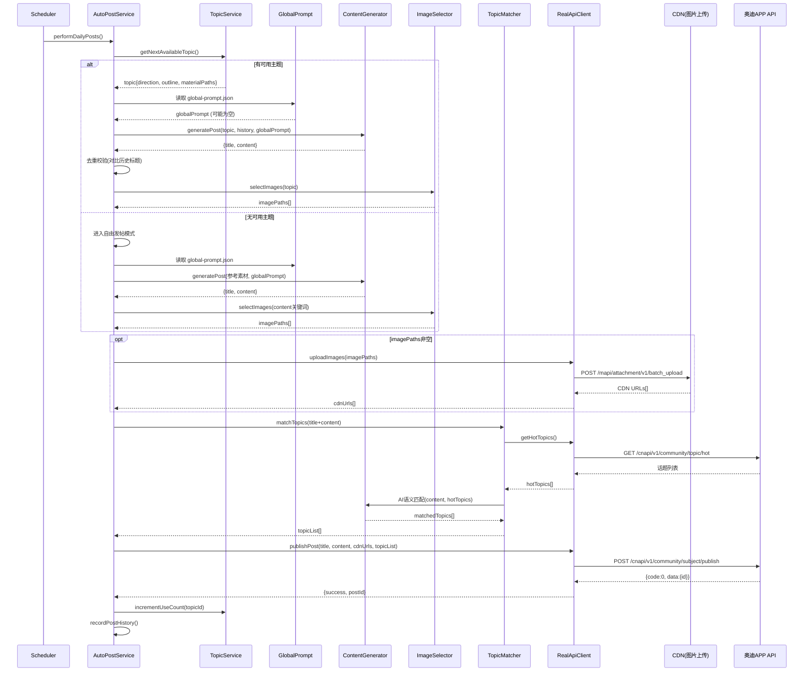

# Design Document: 发帖功能优化

## Overview

本设计文档描述对一汽奥迪APP自动任务系统发帖功能的全面优化升级。核心改动包括六个模块：

1. **全局发帖人设提示（Global Post Prompt）** — 通过 `data/global-prompt.json` 持久化人设配置，注入AI系统提示词统一内容风格
2. **智能话题关联（Topic Matcher）** — 发帖后调用热门话题API，利用AI语义匹配关联话题以增加曝光
3. **智能图文发帖（Image Selector）** — 基于关键词匹配素材目录选取图片，优先发布图文帖
4. **主题复用与内容去重** — 引入 `useCount`/`maxUseCount` 机制允许主题重复使用，通过历史摘要去重确保内容多样性
5. **完整发帖流程实现** — 实现 Real API Client 中图片上传、vrfCode 生成、contentJson 构建和话题关联发帖
6. **自由发帖模式（互联网参考）** — 无可用主题时从小红书等平台获取参考素材，AI改写生成原创内容

设计原则：
- 渐进增强：每个模块独立可降级，单点失败不阻塞发帖流程
- 文件系统持久化：继续使用 JSON 文件存储，与现有架构一致
- AI驱动：话题匹配和内容去重均依赖大模型语义能力，非规则硬编码

## Architecture

### 系统架构图



### 发帖流程时序图



## Components and Interfaces

### 1. GlobalPromptService（新增）

**文件**: `src/services/global-prompt-service.ts`

```typescript
interface GlobalPostPrompt {
  personalInfo: {
    carModel: string;      // 车型，最大50字符
    gender: string;        // 性别，最大50字符
    ageGroup: string;      // 年龄段，最大50字符
  };
  styleDescription: string; // 内容风格描述，最大500字符
}

interface GlobalPromptService {
  /** 读取全局人设配置，文件不存在或损坏返回 null */
  load(): GlobalPostPrompt | null;
  
  /** 保存全局人设配置，返回验证结果 */
  save(prompt: GlobalPostPrompt): { success: boolean; error?: string };
  
  /** 验证字段长度约束 */
  validate(prompt: GlobalPostPrompt): { valid: boolean; errors: string[] };
}
```

**存储路径**: `data/global-prompt.json`

### 2. TopicMatcher（新增）

**文件**: `src/services/topic-matcher.ts`

```typescript
interface HotTopic {
  id: string;
  name: string;        // 格式: "#话题名称#"
  heatDegree: number;
}

interface MatchedTopic {
  id: string;
  name: string;        // 格式: "#话题名称#"
}

interface TopicMatcher {
  /** 获取热门话题列表 */
  fetchHotTopics(token: string): Promise<HotTopic[]>;
  
  /** AI语义匹配，返回0-5个关联话题 */
  matchTopics(title: string, content: string, candidates: HotTopic[]): Promise<MatchedTopic[]>;
}
```

### 3. ImageSelector（新增）

**文件**: `src/services/image-selector.ts`

```typescript
interface ImageSelector {
  /** 
   * 基于关键词从素材库选取图片
   * @param keywords 帖子主题方向文本（用于分词和目录匹配）
   * @param materialPaths 主题预配置的素材路径（非空时直接使用，跳过智能匹配）
   * @returns 选中图片的绝对路径数组，0-9张
   */
  selectImages(keywords: string, materialPaths?: string[]): string[];
}
```

**匹配算法**:
1. 对主题方向文本进行分词（按中文字符边界和标点分割）
2. 遍历素材库所有目录名称，检查是否包含任一关键词
3. 命中的目录按关键词命中数降序排列
4. 从命中最多的目录取直属图片，超过9张随机选取9张

### 4. InternetReferenceService（新增）

**文件**: `src/services/internet-reference-service.ts`

```typescript
interface ReferencePost {
  title: string;
  content: string;
  source: string;        // 来源平台
  url?: string;
}

interface InternetReferenceConfig {
  enabled: boolean;
  searchKeywords: string[];   // 搜索关键词列表
  maxResults: number;         // 最大返回数量 (默认5)
  timeout: number;            // 请求超时 (ms)
  rateLimit: number;          // 每小时最大查询次数 (默认10)
}

interface InternetReferenceService {
  /** 查询互联网参考帖子 */
  search(keywords?: string[]): Promise<ReferencePost[]>;
  
  /** 检查是否在频率限制内 */
  canQuery(): boolean;
}
```

### 5. RealApiClient 扩展

**文件**: `src/api/real-client.ts`（修改现有）

新增方法：

```typescript
interface RealAudiApi {
  /** 上传图片到CDN，返回公开URL列表 */
  uploadImages(token: string, imagePaths: string[]): Promise<{ urls: string[]; failed: number }>;
  
  /** 获取热门话题列表 */
  getHotTopics(token: string, page?: number, pageSize?: number): Promise<HotTopic[]>;
  
  /** 完整发帖（含图片URL、话题列表、vrfCode） */
  publishPost(token: string, title: string, content: string, options?: PublishOptions): Promise<PublishPostResponse>;
}

interface PublishOptions {
  imageUrls?: string[];          // 已上传的CDN图片URL
  topicList?: MatchedTopic[];    // 关联话题列表
}
```

### 6. TopicService 扩展

**文件**: `src/web/services/topics-service.ts`（修改现有）

Topic 接口新增字段：

```typescript
interface Topic {
  // ... 现有字段
  useCount: number;          // 使用次数，初始0
  maxUseCount: number;       // 最大复用次数，默认1
  postHistory: PostSummary[]; // 该主题下的发帖历史摘要
}

interface PostSummary {
  title: string;
  contentSnippet: string;    // 正文前200字符
  timestamp: string;
}
```

### 7. ContentGenerator 扩展

**文件**: `src/ai/content-generator.ts`（修改现有）

`generatePost` 函数签名扩展：

```typescript
interface PostGenerationOptions {
  globalPrompt?: GlobalPostPrompt;     // 全局人设
  topicHistory?: PostSummary[];        // 同主题历史（去重参考）
  referenceTexts?: ReferencePost[];    // 互联网参考素材
}

function generatePost(
  topic: string,
  avoidTopics: string[],
  summary: AnalysisSummary,
  topicConstraint?: string,
  options?: PostGenerationOptions
): Promise<GeneratedPost>;
```

### 8. Web API 路由扩展

**新增路由**:
- `GET /api/global-prompt` — 获取全局人设配置
- `PUT /api/global-prompt` — 保存全局人设配置
- `PATCH /api/topics/:id/max-use-count` — 修改主题最大复用次数

## Data Models

### GlobalPostPrompt (data/global-prompt.json)

```json
{
  "personalInfo": {
    "carModel": "奥迪A6L 2024款",
    "gender": "男",
    "ageGroup": "30-40岁"
  },
  "styleDescription": "资深奥迪车主，驾龄8年，喜欢自驾游和摄影。文风偏理性分享，偶尔加入生活感悟。不喜欢用太多网络热词，但语气亲切随和。"
}
```

### Topic (data/topics.json) — 扩展后

```json
{
  "id": "m1abc123",
  "title": "冬季保养心得",
  "direction": "冬季用车保养",
  "outline": "1. 防冻液检查\n2. 电瓶维护\n3. 轮胎气压",
  "materialPaths": ["河北行/东太行"],
  "status": "unused",
  "useCount": 0,
  "maxUseCount": 3,
  "postHistory": [
    {
      "title": "入冬前必做的5项检查",
      "contentSnippet": "天气转凉了，作为A6L车主...",
      "timestamp": "2026-06-01T10:00:00.000Z"
    }
  ],
  "createdAt": "2026-05-20T08:00:00.000Z"
}
```

### PostHistory 扩展 (data/post-history.json)

```json
[
  {
    "postId": "2063130925127012353",
    "title": "周末洗车记录",
    "topic": "用车日常",
    "contentSnippet": "趁着周末天气好，去了趟洗车店...",
    "timestamp": "2026-06-06T12:30:00.000Z",
    "source": "topic",
    "topicId": "m1abc123",
    "matchedTopics": ["#奥迪日常#", "#洗车打蜡#"],
    "imageCount": 3
  }
]
```

### InternetReference 配置 (config/default.yaml 新增段)

```yaml
internetReference:
  enabled: true
  searchKeywords: ["奥迪", "奥迪A6L", "奥迪用车"]
  maxResults: 5
  timeout: 15000
  rateLimitPerHour: 10
  platform: "xiaohongshu"
```

### vrfCode 结构 (Protobuf 编码)

| 字段号 | 类型 | 内容 | 示例 |
|--------|------|------|------|
| 1 | string | deviceId | AUDI_APP_iPhone_71A0E430-... |
| 2 | string | 当前毫秒时间戳 | "1717670400000" |
| 3 | string | 256字节随机数据的Base64 | "aGVsbG8..." |
| 4 | string | 固定值 | "1" |

### contentJson 结构

发帖时 `momentDto.contentJson` 为 JSON 字符串，结构如下：

```json
[
  {
    "content": "帖子正文内容",
    "inlineStyleEntities": [],
    "blocktype": "block_normal_text"
  }
]
```

纯文字帖和图文帖均使用相同结构，图片通过 `imgUrlList` 独立传递。


## Correctness Properties

*属性（Property）是一种在系统所有有效执行中都应成立的特征或行为——本质上是关于系统应该做什么的形式化陈述。属性是人类可读规格说明与机器可验证正确性保证之间的桥梁。*

### Property 1: 全局人设字段长度验证

*For any* GlobalPostPrompt 对象，validate 函数应满足：personalInfo 中各字段长度 <= 50 字符时通过验证，超过 50 字符时拒绝；styleDescription 长度 <= 500 字符时通过验证，超过 500 字符时拒绝。

**Validates: Requirements 1.2, 1.6, 1.7**

### Property 2: Prompt 构建顺序（人设优先注入）

*For any* 有效的 GlobalPostPrompt 和 AnalysisSummary，构建的系统提示词中 GlobalPostPrompt 的内容应出现在 AnalysisSummary.styleDescription 内容之前。

**Validates: Requirements 1.4**

### Property 3: 话题关联数量上限

*For any* AI 返回的话题匹配结果列表（长度 0-N），经过 TopicMatcher 处理后的输出列表长度应满足 0 <= length <= 5。

**Validates: Requirements 2.3**

### Property 4: 图片选取数量约束

*For any* 非空的候选图片集合，ImageSelector 选取的图片数量应满足 1 <= count <= 9。当候选图片为空时，返回空数组。

**Validates: Requirements 3.1, 3.2**

### Property 5: 关键词目录匹配优先级

*For any* 主题方向文本和素材目录结构，ImageSelector 的关键词匹配应优先选取命中关键词数量最多的目录下的图片。即：如果目录 A 命中了 3 个关键词，目录 B 命中了 1 个关键词，则返回的图片应来自目录 A。

**Validates: Requirements 3.3**

### Property 6: 主题可用性不变量

*For any* 主题，其可用状态应等价于 useCount < maxUseCount。当 useCount < maxUseCount 时主题在 getNextAvailableTopic 的候选列表中；当 useCount >= maxUseCount 时主题不在候选列表中。

**Validates: Requirements 4.2, 4.3**

### Property 7: 使用计数递增

*For any* 初始 useCount 值 n（0 <= n < maxUseCount），对该主题执行一次成功发帖后，useCount 应等于 n + 1。

**Validates: Requirements 4.7**

### Property 8: contentJson 构建正确性（Round-Trip）

*For any* 有效的帖子正文内容字符串，buildContentJson 生成的结果应满足：(1) 是有效的 JSON 字符串，(2) 解析后为数组，(3) 数组第一个元素的 content 字段等于原始内容。

**Validates: Requirements 5.3**

### Property 9: vrfCode 编码结构正确性

*For any* deviceId 字符串，generateVrfCode 生成的结果应满足：(1) 是有效的 Base64 字符串，(2) 解码后的 Protobuf 数据包含该 deviceId，(3) 包含一个合法的毫秒时间戳，(4) 包含固定值 "1"。

**Validates: Requirements 5.3**

### Property 10: 内容原创性检测

*For any* 生成的帖子内容和参考素材列表，抄袭检测函数应能正确识别：当内容中存在与任一参考素材连续相同 >= 30 个字符的片段时返回 true（检测到抄袭），否则返回 false。

**Validates: Requirements 6.4**

### Property 11: 频率限制不变量

*For any* 时间窗口（1小时），InternetReferenceService 的速率限制器在该窗口内前 10 次 canQuery() 调用应返回 true，第 11 次及之后应返回 false。窗口重置后应重新允许查询。

**Validates: Requirements 6.8**

## Error Handling

### 降级策略总览

本系统采用"渐进降级"策略，每个模块的错误不会阻塞核心发帖流程：

| 模块 | 错误场景 | 降级行为 |
|------|----------|----------|
| GlobalPromptService | 文件不存在/损坏/读取异常 | 记录警告日志，按无人设配置继续（仅使用社区风格） |
| TopicMatcher | 热门话题API超时/失败 | 返回空列表，帖子以无话题方式发布 |
| TopicMatcher | AI匹配调用失败 | 返回空列表，帖子以无话题方式发布 |
| ImageSelector | 无匹配目录/无图片 | 发布纯文字帖子 |
| RealApiClient | 图片上传全部失败 | 记录警告日志，以纯文字方式继续发帖 |
| RealApiClient | 图片上传部分失败 | 仅使用成功上传的URL，记录警告日志 |
| RealApiClient | 发帖API返回非零code | 记录错误日志，返回 {success: false} |
| TopicService | 标题去重失败（重试2次仍重复） | 跳过该主题，记录警告日志 |
| InternetReferenceService | 查询超时/错误 | 回退到基于社区分析的自由生成模式 |
| InternetReferenceService | 频率超限 | 直接回退到社区分析模式，不发起请求 |

### 具体错误处理规范

#### 文件 I/O 错误
```typescript
// global-prompt.json 读取
try {
  const data = fs.readFileSync(path, 'utf-8');
  return JSON.parse(data);
} catch (error) {
  logger.error(`读取全局人设配置失败: ${error.message}`);
  return null; // 降级为无人设
}
```

#### 网络请求错误
- **超时**: 所有外部API请求统一使用配置的 timeout 值（默认10秒），超时后记录日志并降级
- **HTTP错误**: 检查响应 `code` 字段，非零即为失败
- **Token过期**: 通过响应头 `x-access-token` 自动续期，续期失败需重新登录

#### AI 调用错误
- 使用现有的多 Provider Fallback 机制（gpt → higpt）
- 每个 Provider 最多重试2次
- 全部失败时记录聚合错误并中断当前操作

#### 数据一致性
- useCount 增加和 postHistory 记录在同一事务中完成（先记录历史，再增加计数）
- 发帖失败时不增加 useCount，不记录历史

## Testing Strategy

### 测试框架

- **单元测试**: Jest（已配置）
- **属性测试**: fast-check（已安装，v3.22.0）
- **API集成测试**: supertest（已安装）

### 属性测试配置

每个属性测试配置最少 100 次迭代：

```typescript
import fc from 'fast-check';

// 统一配置
const PBT_CONFIG = { numRuns: 100 };
```

### 测试文件组织

```
tests/
├── unit/
│   ├── global-prompt-service.test.ts    // Property 1, 2
│   ├── topic-matcher.test.ts            // Property 3
│   ├── image-selector.test.ts           // Property 4, 5
│   ├── topics-service.test.ts           // Property 6, 7
│   ├── publish-helpers.test.ts          // Property 8, 9
│   ├── plagiarism-detector.test.ts      // Property 10
│   └── rate-limiter.test.ts             // Property 11
├── integration/
│   ├── auto-post-flow.test.ts           // 完整发帖流程
│   ├── real-client-upload.test.ts       // 图片上传集成
│   └── web-api.test.ts                  // Web管理API
└── helpers/
    └── generators.ts                     // fast-check 自定义生成器
```

### 属性测试标签规范

每个属性测试需添加注释引用对应设计属性：

```typescript
// Feature: posting-optimization, Property 1: 全局人设字段长度验证
it('should validate field length constraints', () => {
  fc.assert(fc.property(
    fc.string({ minLength: 0, maxLength: 100 }),
    (text) => { /* ... */ }
  ), PBT_CONFIG);
});
```

### 单元测试覆盖范围

| 模块 | 覆盖内容 |
|------|----------|
| GlobalPromptService | 文件不存在/损坏降级、保存成功反馈 |
| TopicMatcher | API超时降级、AI返回空列表 |
| ImageSelector | materialPaths 优先、空素材降级 |
| TopicService | maxUseCount 默认值、标题去重重试逻辑 |
| RealApiClient | Token续期检测、请求头构建 |
| ContentGenerator | Prompt注入顺序、历史摘要传递 |
| InternetReferenceService | 超时回退、频率超限 |

### Mock 策略

- 外部 API（奥迪服务端）: 使用 axios mock adapter
- AI 调用: Mock `generateContent` 函数返回预设结果
- 文件系统: 使用 Jest mock 或 memfs 进行隔离
- 时间: 使用 Jest fake timers 控制时间窗口（频率限制测试）
