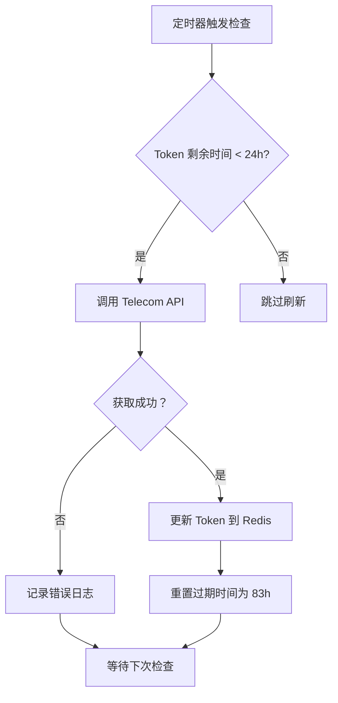

# 一汽奥迪 Token 使用逻辑复盘

## 一、Token 刷新策略调整

### 修改内容
**文件**: [`src/services/auth.ts`](file:///Users/mac/Documents/workspace/krio/yqad/src/services/auth.ts#L27-L28)

**修改前**:
```typescript
private readonly TOKEN_REFRESH_INTERVAL = 12 * 60 * 60 * 1000; // 12 小时
private readonly TOKEN_REFRESH_LEAD_TIME = 6 * 60 * 60 * 1000;  // 6 小时
```

**修改后**:
```typescript
private readonly TOKEN_REFRESH_INTERVAL = 6 * 60 * 60 * 1000;   // 6 小时
private readonly TOKEN_REFRESH_LEAD_TIME = 24 * 60 * 60 * 1000; // 24 小时
```

### 优化效果
- **检查频率提升**: 从每 12 小时检查一次 → 每 6 小时检查一次
- **刷新提前量增加**: 从剩余 6 小时刷新 → 剩余 24 小时刷新
- **安全裕度**: 确保 Token 始终有充足的剩余时间，避免过期风险

---

## 二、Token 使用场景全景

### 1. 自动发帖服务（auto-post.ts）

**文件**: [`src/services/auto-post.ts`](file:///Users/mac/Documents/workspace/krio/yqad/src/services/auto-post.ts)

#### 使用位置：

| 行号 | 场景 | 说明 |
|------|------|------|
| 655 | 签到操作 | 调用签到接口前获取 Token |
| 669 | 图片上传 | 上传图片到奥迪 CDN（需要 Token） |
| 690 | 帖子列表获取 | 调用帖子列表接口前获取 Token |
| 1100 | 图片上传 | 上传图片到奥迪 CDN（需要 Token） |
| 1201 | 图片上传 | 上传图片到奥迪 CDN（需要 Token） |
| 1387 | 图片上传 | 上传图片到奥迪 CDN（需要 Token） |

**调用链路**:
```
AutoPostService.execute() 
  → authService.getAccessToken() 
  → 检查 Token 有效性 
  → 如剩余时间 < 24 小时则触发刷新 
  → 调用 Telecom API 获取最新 Token 
  → 返回有效 Token
  
⚠️ 注意：AutoJS 远程发帖使用手机 Token，不需要服务端 Token
```

---

### 2. 自动评论服务（auto-comment.ts）

**文件**: [`src/services/auto-comment.ts`](file:///Users/mac/Documents/workspace/krio/yqad/src/services/auto-comment.ts)

#### 使用位置：

| 行号 | 场景 | 说明 |
|------|------|------|
| 132 | 评论发布 | 调用评论发布接口前获取 Token |
| 297 | 批量评论循环 | 每条评论发布前获取最新 Token |
| 562 | 评论相关操作 | 其他评论流程中的 Token 需求 |

**调用链路**:
```
AutoCommentService.executeComment()
  → authService.getAccessToken()
  → 检查 Token 有效性（如剩余时间 < 24 小时则刷新）
  → api.publishComment(token, postId, content)
```

---

### 3. 会员信息查询（member-routes.ts）

**文件**: [`src/web/routes/member-routes.ts`](file:///Users/mac/Documents/workspace/krio/yqad/src/web/routes/member-routes.ts#L35)

#### 使用位置：

```typescript
// GET /api/member/info
const accessToken = await auth.getAccessToken();
const memberInfo = await api.getMemberInfo(accessToken);
```

**用途**: 通过 Web UI 查看当前会员等级、积分、成长值等信息

---

### 4. Token 状态查询（auth-routes.ts）

**文件**: [`src/web/routes/auth-routes.ts`](file:///Users/mac/Documents/workspace/krio/yqad/src/web/routes/auth-routes.ts#L307)

#### 使用位置：

```typescript
// GET /api/auth/token-status
const accessToken = await auth.getAccessToken();
// 用于验证 Token 是否有效并返回状态
```

**用途**: 提供 Token 状态查询接口，供前端展示剩余时间、过期时间等

---

### 5. Token 手动刷新（token-routes.ts）

**文件**: [`src/web/routes/token-routes.ts`](file:///Users/mac/Documents/workspace/krio/yqad/src/web/routes/token-routes.ts#L170)

#### 使用位置：

```typescript
// POST /api/token/refresh-from-telecom
const newToken = await axios.get(`${serviceConfig.apiUrl}/api/v1/audi/token`);
authService.saveLoginToken(newToken, 300000); // 83 小时
```

**用途**: 提供手动触发 Token 刷新的接口，从 Telecom API 获取最新 Token

---

## 三、Token 刷新机制详解

### 触发条件

```typescript
// 每 6 小时检查一次
if (remainingTime < 24 * 60 * 60 * 1000) {
  // 剩余时间不足 24 小时，触发刷新
  await checkAndRefreshToken();
}
```

### 刷新流程



### 刷新日志示例

**触发刷新时**:
```
========================================
【Token 主动刷新检查 - 触发刷新】
  当前 Token: eyJhbGciOiJIUzI1NiIsIn...
  当前剩余时间：20 小时
  过期时间：2026-07-28 10:00:00
  刷新阈值：24 小时（剩余时间低于此值时主动刷新）
  刷新方式：Telecom API（手机 APP 提取）
========================================
```

**刷新成功**:
```
========================================
【Token 主动刷新结果 - 成功】
  刷新接口：Telecom API (/api/v1/audi/token)
  请求耗时：234ms
  刷新状态：✅ 成功
  旧 Token: eyJhbGciOiJIUzI1NiIsIn...
  新 Token: eyJhbGciOiJIUzI1NiIsIn...
  续期前过期时间：2026-07-28 10:00:00
  续期后过期时间：2026-08-01 10:00:00
  延长小时数：59.0 小时
========================================
```

---

## 四、Token 来源与存储

### 来源
1. **Web UI 登录**: 用户通过 Web 管理界面输入手机号验证码登录
2. **Telecom API 自动刷新**: 定时任务从手机 APP WebView Cookies 提取
3. **响应头自动续期**: 调用 API 时上游返回的新 Token（兜底机制）

### 存储
- **主存储**: Redis `auth:token` key
- **降级方案**: 内存存储（Redis 不可用时）
- **持久化**: 每次 Token 变更后立即保存到 Redis

---

## 五、Token 生命周期

```
获取 Token (登录/刷新)
  ↓
保存到 Redis (auth:token)
  ↓
每 6 小时检查剩余时间
  ↓
剩余时间 < 24h? 
  ├─ 是 → 调用 Telecom API 刷新 → 更新 Redis
  └─ 否 → 继续使用
  ↓
Token 完全过期 (code=10009)
  ↓
需要重新登录
```

---

## 六、关键配置

| 配置项 | 值 | 说明 |
|--------|------|------|
| 检查间隔 | 6 小时 | 定期检查 Token 剩余时间的频率 |
| 刷新阈值 | 24 小时 | 剩余时间低于此值时触发刷新 |
| Token 有效期 | ~83 小时 | 每次刷新后重置为 83 小时 |
| 刷新方式 | Telecom API | 从手机 APP WebView Cookies 提取 |
| 存储位置 | Redis `auth:token` | 支持降级到内存 |

---

## 七、相关 API 接口

### 1. 会员信息接口
- **端点**: `GET /mapi/member/v1/member/info`
- **需要 Token**: ✅
- **刷新方式**: 响应头 `x-access-token`（兜底）

### 2. 帖子列表接口
- **端点**: `GET /cnapi/v2/feed`
- **需要 Token**: ✅
- **刷新方式**: 无（定期刷新机制）

### 3. 签到接口
- **端点**: `POST /cnapi/v1/point/signIn`
- **需要 Token**: ✅
- **刷新方式**: 无（定期刷新机制）

### 4. 评论发布接口
- **端点**: `POST /cnapi/v2/comment/submit`
- **需要 Token**: ✅
- **刷新方式**: 无（定期刷新机制）

### 5. 帖子发布接口
- **端点**: 远程 AutoJS（不直接调用）
- **需要 Token**: ✅（用于获取帖子内容）
- **刷新方式**: 无（定期刷新机制）

---

## 八、监控与告警

### 日志监控点
1. `[auth] 【Token 定期刷新机制已启动】` - 服务启动时确认机制已启用
2. `[auth] 【Token 主动刷新检查 - 触发刷新】` - 刷新触发记录
3. `[auth] 【Token 主动刷新结果 - 成功/失败】` - 刷新结果
4. `[member-routes] 获取会员信息失败：code=10009` - Token 已过期告警

### 建议告警规则
- Token 剩余时间 < 12 小时 → 发送告警通知
- 连续 3 次刷新失败 → 发送紧急告警
- 出现 `code=10009` 错误 → 立即通知重新登录

---

## 九、总结

### Token 使用频率排序

1. **图片上传到 CDN** - 每次发帖调用 1-3 次（必需 Token）
2. **签到操作** - 每次签到流程调用 1 次
3. **帖子列表获取** - 获取帖子时调用
4. **自动评论** - 每条评论调用 1 次
5. **会员信息查询** - 用户主动查询时调用
6. **Token 状态检查** - 前端轮询或手动检查

⚠️ **重要说明**：
- AutoJS 远程发帖**不需要服务端 Token**
- 手机端使用自己的 Token（从手机 WebView Cookies 提取）
- 服务端 Token 仅用于：图片上传、签到、获取帖子列表等服务端直接调用奥迪 API 的场景

### 刷新机制可靠性
- ✅ **双重保障**: 定期主动刷新 + 响应头检测兜底
- ✅ **提前量大**: 24 小时阈值确保充足缓冲时间
- ✅ **检查频繁**: 6 小时检查间隔及时发现问题
- ✅ **降级方案**: Redis 故障时自动降级到内存

### 风险提示
- ⚠️ Telecom API 服务必须保持可用（手机在线、服务运行）
- ⚠️ Token 完全过期后必须手动重新登录
- ⚠️ 建议配置告警通知，及时发现刷新失败

---

**文档生成时间**: 2026-07-26  
**相关文件**: 
- [`src/services/auth.ts`](file:///Users/mac/Documents/workspace/krio/yqad/src/services/auth.ts)
- [`src/services/auto-post.ts`](file:///Users/mac/Documents/workspace/krio/yqad/src/services/auto-post.ts)
- [`src/services/auto-comment.ts`](file:///Users/mac/Documents/workspace/krio/yqad/src/services/auto-comment.ts)
- [`docs/faw-audi-member-api.md`](file:///Users/mac/Documents/workspace/krio/yqad/docs/faw-audi-member-api.md)
