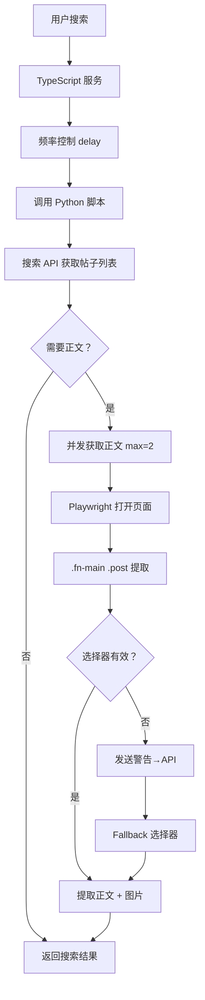

# 汽车之家爬虫技术方案

## 一、技术架构

### 1.1 整体架构

```
┌─────────────────────────────────────────────────────────────┐
│                    TypeScript 服务层                          │
│  - 配置管理（AutohomeConfig）                                │
│  - 错误处理（错误分类、自动重试）                             │
│  - 频率控制（随机延迟）                                       │
│  - 接口封装（ISearchPlatform）                               │
└─────────────────────────────────────────────────────────────┘
                              ↓
┌─────────────────────────────────────────────────────────────┐
│                    Python 脚本层                              │
│  - 搜索 API 调用（requests）                                  │
│  - 正文获取（Playwright）                                     │
│  - 并发控制（asyncio.Semaphore）                             │
│  - 重试机制（指数退避）                                       │
└─────────────────────────────────────────────────────────────┘
                              ↓
┌─────────────────────────────────────────────────────────────┐
│                    汽车之家 API                               │
│  - 搜索 API: sou.api.autohome.com.cn/v1/search              │
│  - 无需 Cookie，直接调用                                     │
└─────────────────────────────────────────────────────────────┘
```

### 1.2 核心流程



## 二、技术实现细节

### 2.1 搜索 API 调用

**端点**: `https://sou.api.autohome.com.cn/v1/search`

**特点**:
- ✅ 无需 Cookie，直接调用
- ✅ 支持分页（每页 20 条，最多 10 页）
- ✅ 返回帖子列表（标题、URL、作者、回复数等）

**关键参数**:
```python
params = {
    "uuid": req_uuid,              # 随机 UUID
    "source": "pc",
    "q": keyword,                  # 搜索关键词
    "offset": str(offset),         # 偏移量
    "size": str(page_size),        # 每页数量 (20)
    "page": str(page),             # 页码
    "ext": json.dumps({...}),      # 扩展参数
}
```

### 2.2 正文获取

**技术方案**: Playwright 无头浏览器

**选择器**: `.fn-main .post`（已验证有效）

**技术特点**:
- ✅ 精准选择器定位正文
- ✅ 自动过滤表情、图标、二维码等非正文图片
- ✅ 支持懒加载图片（滚动页面触发）
- ✅ 包含页面结构监控和 fallback 机制

**超时控制**:
- 页面加载超时：20 秒
- 初始等待：3 秒
- 滚动等待：1.5 秒
- 总超时：25 秒

### 2.3 并发控制

**并发策略**: Semaphore 信号量控制

```python
# 创建信号量（最大并发数：2）
semaphore = asyncio.Semaphore(2)

async def fetch_with_semaphore(url, index, total):
    async with semaphore:
        return await fetch_post_content(url)
```

**性能优化**:
- 并发数：2（降低资源占用）
- 平均耗时：8-12 秒（2 条正文）
- 单条速度：4-6 秒/条

### 2.4 重试机制

**重试策略**: 指数退避（Exponential Backoff）

```python
max_retries = 2
retry_delay = 3000  # 3 秒
retry_backoff = 1.5

# 第 1 次重试：3 秒
# 第 2 次重试：4.5 秒 (3 * 1.5)
```

**错误分类**:
| 错误类型 | 是否重试 | 说明 |
|---------|---------|------|
| SELECTOR_NOT_FOUND | ❌ | 选择器未找到 |
| PAGE_STRUCTURE_CHANGED | ❌ | 页面结构变更 |
| TIMEOUT | ✅ | 超时 |
| API_ERROR | ✅ | API 错误 (5xx) |
| NETWORK_ERROR | ✅ | 网络错误 |

### 2.5 页面监控

**功能**: 当选择器 `.fn-main .post` 失效时，自动发送警告到配置页面

**实现**:
```python
# 1. 检测选择器失效
if not content_element:
    print("⚠️ 选择器失效")
    
    # 2. 发送警告到 API（带去重）
    send_warning_to_api("页面结构可能已变更...")
    
    # 3. 使用 fallback 选择器
    fallback_selectors = [".post", ".thread-content", ...]
```

**去重机制**: 1 小时内不重复发送相同警告

**前端显示**: 黄色警告横幅（配置页面）

## 三、配置管理

### 3.1 配置参数

```typescript
interface AutohomeConfig {
  // 延迟控制
  searchDelayMin: 2000;     // 2 秒
  searchDelayMax: 5000;     // 5 秒
  pageDelayMin: 3000;       // 3 秒
  pageDelayMax: 6000;       // 6 秒
  
  // 重试机制
  maxRetries: 2;
  retryDelay: 3000;         // 3 秒
  retryBackoff: 1.5;
  
  // 超时控制
  requestTimeout: 30000;    // 30 秒
  pageLoadTimeout: 20000;   // 20 秒
  
  // 并发控制
  maxConcurrent: 2;         // 2 个并发
  
  // 其他
  maxResults: 10;
}
```

### 3.2 配置位置

- TypeScript: `src/services/internet-search/autohome-search.ts`
- Python: `scripts/test_autohome.py` (CONFIG 字典)

## 四、错误处理

### 4.1 错误类型枚举

```typescript
enum AutohomeErrorType {
  NETWORK_ERROR = 'NETWORK_ERROR',
  API_ERROR = 'API_ERROR',
  SELECTOR_NOT_FOUND = 'SELECTOR_NOT_FOUND',
  PAGE_STRUCTURE_CHANGED = 'PAGE_STRUCTURE_CHANGED',
  RATE_LIMITED = 'RATE_LIMITED',
  TIMEOUT = 'TIMEOUT',
  UNKNOWN = 'UNKNOWN',
}
```

### 4.2 错误分类函数

```typescript
classifyError(error: Error, statusCode?: number): AutohomeError {
  const message = error.message.toLowerCase();
  
  // 选择器未找到
  if (message.includes('selector') || message.includes('not found')) {
    return {
      type: AutohomeErrorType.SELECTOR_NOT_FOUND,
      shouldRetry: false,
    };
  }
  
  // 超时
  if (message.includes('timeout')) {
    return {
      type: AutohomeErrorType.TIMEOUT,
      shouldRetry: true,
    };
  }
  
  // ... 其他错误类型
}
```

## 五、性能优化

### 5.1 优化措施

| 优化项 | 优化前 | 优化后 | 提升 |
|-------|--------|--------|------|
| 并发数 | 3 | 2 | -33% 资源占用 |
| 页面加载超时 | 30 秒 | 20 秒 | -33% |
| 初始等待 | 5 秒 | 3 秒 | -40% |
| 滚动等待 | 3 秒 | 1.5 秒 | -50% |
| 总超时 | 30 秒 | 25 秒 | -17% |
| 平均耗时 | ~12-15 秒 | ~8-12 秒 | **~30% 提升** |

### 5.2 性能监控

```python
start_time = time.time()
content_dict = await fetch_multiple_posts_concurrently(urls_to_fetch, max_concurrent)
elapsed = time.time() - start_time

print(f"✅ 正文获取完成")
print(f"   - 总耗时：{elapsed:.1f}秒")
print(f"   - 成功：{success_count}/{len(urls_to_fetch)}")
print(f"   - 平均速度：{elapsed/len(urls_to_fetch):.1f}秒/条")
```

## 六、代码结构

### 6.1 TypeScript 服务

```
src/services/internet-search/autohome-search.ts
├── AutohomeErrorType (错误类型枚举)
├── AutohomeError (错误接口)
├── AutohomeConfig (配置接口)
├── AutohomePost (搜索结果接口)
└── AutohomeSearch (服务类)
    ├── initialize() (初始化)
    ├── search() (搜索)
    ├── searchViaPython() (调用 Python)
    ├── getPostDetail() (获取详情 - 预留)
    ├── testConnection() (测试连接)
    └── isAvailable() (检查可用性)
```

### 6.2 Python 脚本

```
scripts/test_autohome.py
├── CONFIG (配置字典)
├── is_valid_content_image() (图片过滤)
├── search_autohome() (搜索 API)
├── send_warning_to_api() (发送警告)
├── fetch_post_content_with_retry() (带重试)
├── fetch_post_content() (Playwright 获取)
├── fetch_multiple_posts_concurrently() (并发获取)
├── search_with_content() (搜索 + 正文)
└── main() (主函数)
```

## 七、最佳实践

### 7.1 频率控制

- ✅ 搜索间隔：2-5 秒随机延迟
- ✅ 页面间隔：3-6 秒随机延迟
- ✅ 避免短时间内大量请求

### 7.2 错误处理

- ✅ 区分可重试和不可重试错误
- ✅ 指数退避重试策略
- ✅ 详细的错误日志

### 7.3 资源管理

- ✅ 并发数限制（2 个）
- ✅ 超时控制（25 秒）
- ✅ 浏览器资源及时释放

### 7.4 监控告警

- ✅ 选择器失效自动检测
- ✅ 警告发送去重（1 小时）
- ✅ 前端配置页面显示

## 八、故障排查

### 8.1 常见问题

**问题 1**: 选择器失效警告频繁出现

**解决**:
1. 检查汽车之家页面是否真的变更
2. 验证 `.fn-main .post` 选择器是否仍然有效
3. 如确认变更，更新选择器或 fallback 列表

**问题 2**: 正文获取失败率高

**解决**:
1. 检查网络连接
2. 增加页面加载超时（20 秒 → 30 秒）
3. 检查 Playwright 是否正常工作

**问题 3**: 搜索结果为空

**解决**:
1. 检查搜索 API 是否可访问
2. 验证请求参数（uuid、timestamp 等）
3. 检查关键词是否过于冷门

### 8.2 日志位置

- TypeScript 日志：`logs/autohome-search.log`
- Python 日志：标准输出（stdout）
- 警告信息：配置页面横幅

## 九、未来优化方向

### 9.1 短期优化

- [ ] 支持从数据库动态加载配置
- [ ] 实现 getPostDetail() 方法
- [ ] 添加更多 fallback 选择器

### 9.2 长期优化

- [ ] 探索纯 API 方案（替代 Playwright）
- [ ] 实现智能选择器（自动识别正文）
- [ ] 添加性能指标监控（Prometheus）

## 十、参考资料

- [汽车之家移动端 API 文档](https://api.autohome.com.cn/)
- [Playwright 官方文档](https://playwright.dev/python/)
- [小红书爬虫技术方案](./小红书爬虫技术方案.md)
